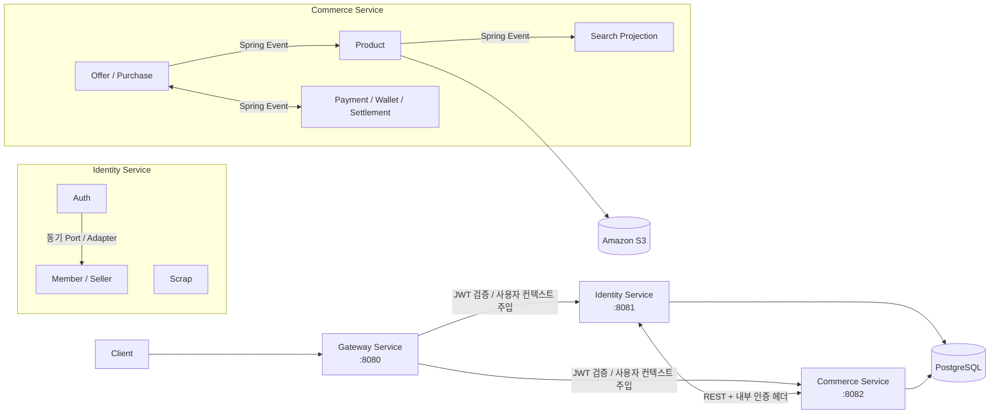

<div align="center">


단순한 가격 경쟁이 아닌, 판매자의 스토리를 통해 상품의 가치를 전달하고, 그 가치를 중심으로 거래가 이루어지는 한정판 거래 플랫폼입니다.
</div>

<hr>

## 목차
- [Stack](#stack)
- [프로젝트 구조](#프로젝트-구조)
- [시스템 아키텍처](#시스템-아키텍처)
- [실행 단위](#실행-단위)
- [아키텍처 여정](#아키텍처-여정)
- [구현과 핵심 기능](#구현과-핵심-기능)
- [실패와 남은 과제](#실패와-남은-과제)
- [로컬 실행](#로컬-실행)
- [테스트](#테스트)
- [구성원](#구성원)

<hr>

## Stack

**Language**
<br>


**Framework**
<br>


**Build Tool**
<br>


**Database**
<br>


**Auth**
<br>


**Infra**
<br>


<hr>

## 프로젝트 구조

현재는 멀티모듈로 구성되어 있으며 4계층 (domain / application / infrastructure / presentation)으로 나누어 작업중입니다.

```
dear
├── common                          # 공통 모듈 (API 응답 포맷, 인증, 예외, 이벤트, 감사 로그)
├── gateway-service                 # API Gateway (Spring Cloud Gateway)
├── identity-service                # 인증 · 회원 서비스
│   └── shop.dear.identity
│       ├── auth
│       │   ├── authentication      # 로그인 / 토큰 발급
│       │   └── authorization       # 인가
│       ├── member                  # 회원
│       └── scrap                   # 스크랩
└── commerce-service                # 상품 · 주문 · 정산 서비스
    └── shop.dear.commerce
        ├── product                 # 상품
        ├── order
        │   ├── offer               # 오퍼(제안)
        │   ├── offersnapshot       # 오퍼 스냅샷
        │   └── purchase            # 구매
        ├── financial
        │   ├── payment             # 결제
        │   ├── settlement          # 정산
        │   ├── settlementpolicy    # 정산 정책
        │   └── wallet              # 예치금
        └── search                  # 검색
```

<hr>

## 기능 소개

<table>
    <tr>
        <th>기능</th>
        <th>설명</th>
    </tr>
    <tr>
        <td>인증, 인가</td>
        <td>이메일, 비밀번호 기반 회원가입, 로그인/로그아웃, 회원 탈퇴, JWT 액세스/리프레시 토큰 발급 및 재발급</td>
    </tr>
    <tr>
        <td>회원</td>
        <td>유저 프로필 관리, 판매자 등록 및 계좌 관리</td>
    </tr>
    <tr>
        <td>스크랩</td>
        <td>상품 스크랩, 스크랩 목록 조회</td>
    </tr>
    <tr>
        <td rowspan="2">상품</td>
        <td>판매 상품 관리, 등록 및 스크랩한 상품 목록 조회, 상품 상세 조회, S3 이미지 업로드</td>
    </tr>
    <tr>
        <td>공개 대기 시스템 구현 (매일 20시, 등록 대기상태인 상품을 일괄로 판매 상태 자동 전환)</td>
    </tr>
    <tr>
        <td>검색</td>
        <td>상품명, 카테고리, 스토리 기반 상품 검색, 최신순, 조회수순, 가격순 정렬, 상품 변경 이벤트 기반 검색 색인 실시간 동기화</td>
    </tr>
    <tr>
        <td>오퍼</td>
        <td>오퍼 목록 조회, 오퍼 생성, 판매자의 오퍼 수락 결정,  오퍼 스냅샷 생성</td>
    </tr>
    <tr>
        <td>즉시구매</td>
        <td>즉시구매 신청, 조회, 취소, 구매확정, 가격제안(오퍼) 생성, 목록/상세 조회, 수락/거절</td>
    </tr>
    <tr>
        <td>정산</td>
        <td>정산 이력 조회, 정산예정대금 조회, 판매대금 정산 스케줄러 구현</td>
    </tr>
    <tr>
        <td>예치금</td>
        <td>예치금 입출금내역 조회, 예치금 충전, 조회, 결제 후 차감 기능 구현</td>
    </tr>
</table>

<hr>

## 시스템 아키텍처



### 실행 단위

| 모듈 | 포트 | 역할                              |
| --- | --- |---------------------------------|
| `gateway-service` | 8080 | 외부 요청 라우팅, JWT 검증, 인증 사용자 헤더 주입 |
| `identity-service` | 8081 | 인증 계정, 회원 프로필, 판매자, 스크랩 관리      |
| `commerce-service` | 8082 | 상품, 검색, 오퍼, 즉시 구매, 결제 및 정산      |
| `common` | - | 공통 응답, 예외, 인증 컨텍스트, 이벤트 계약      |

현재 구조는 완전히 분리된 MSA가 아닙니다. 세 개의 Spring Boot 애플리케이션을 독립 실행하지만, 로컬 환경에서는 Identity와 Commerce가 하나의 PostgreSQL 인스턴스를 사용합니다. 각 실행 모듈 내부는 도메인별 패키지 경계를 둔 모듈러 모놀리스로 구성했습니다.

## 아키텍처 여정

### 1. Auth와 Member의 책임 분리

초기 Member는 이메일, 비밀번호, 프로필을 모두 소유했습니다. 이 상태에서 Auth를 추가하자 비밀번호 검증과 토큰 발급 책임이 두 도메인에 걸쳐 모호해졌습니다.

논의 끝에 다음과 같이 책임을 다시 나눴습니다.

- **Auth**: 이메일, 비밀번호 해시, 역할, Access Token과 Refresh Token
- **Member**: 이름, 닉네임, 배송지, 전화번호, 판매자 정보

회원가입은 AuthAccount와 Member 프로필이 모두 생성되어야 하며, AuthAccount를 완성하려면 Member가 발급한 memberId가 즉시 필요합니다. 향후 MSA 전환을 고려해 같은 애플리케이션 안에서도 HTTP를 사용하는 방안을 검토했지만 다음 문제가 있었습니다.

- 자기 자신에게 네트워크 요청을 보내는 불필요한 비용이 발생합니다.
- 하나의 로컬 트랜잭션을 공유할 수 없어 부분 성공과 보상 처리를 미리 설계해야 합니다.
- 타임아웃, 재시도, 중복 요청처럼 아직 필요하지 않은 분산 시스템 문제가 생깁니다.

현재는 Auth가 정의한 Port를 Member Adapter가 구현하고, 내부에서 MemberService를 동기 호출합니다. 두 작업은 하나의 로컬 트랜잭션에 참여합니다. 추후 서비스가 물리적으로 분리되면 Adapter를 HTTP 또는 메시지 기반 구현으로 교체하고, Saga나 보상 트랜잭션을 함께 도입할 계획입니다.

### 2. Gateway를 인증의 신뢰 경계로 만들기

각 Controller는 @AuthUser Long memberId로 현재 사용자를 받습니다. 그러나 외부 클라이언트가 X-Authenticated-Member-Id 헤더를 직접 보낼 수 있다면 다른 회원으로 가장할 수 있습니다.

Gateway에서 다음 순서로 인증 경계를 구성했습니다.

1. 외부 요청의 X-Authenticated-Member-Id를 항상 제거합니다.
2. Bearer Access Token의 서명, 만료 시간, 토큰 종류를 검증합니다.
3. 검증에 성공한 토큰의 memberId만 내부 헤더로 다시 주입합니다.
4. 하위 서비스는 공통 @AuthUser Argument Resolver로 해당 값을 사용합니다.

비밀번호는 BCrypt로 해시하고, Access Token은 15분, Refresh Token은 14일로 운영합니다. Refresh Token 원문은 HttpOnly Cookie로 전달하고 서버에는 SHA-256 해시만 저장합니다. 재발급 시 토큰을 회전하며, 이미 교체된 토큰이 다시 사용되면 유출 가능성이 있다고 보고 해당 회원의 Refresh Token을 폐기합니다.

### 3. Elasticsearch 없이 검색 모델 분리하기

세미 프로젝트에서는 Elasticsearch를 사용하지 않되, 최종 프로젝트에서 검색 엔진으로 교체할 수 있는 구조를 목표로 했습니다.

Product의 테이블을 검색 요청마다 복잡하게 Join 하는 대신 search_product 검색 전용 테이블을 두었습니다. Product 변경 이벤트를 트랜잭션 커밋 이후 수신해 별도 트랜잭션으로 검색 모델을 갱신합니다.

- 상품명과 스토리 내용: LIKE 검색
- 카테고리: 정확히 일치하는 필터
- 정렬: 최신순, 조회수순, 가격 오름차순 / 내림차순
- 판매 완료 또는 삭제된 상품은 검색 모델에서 제거

검색 애플리케이션은 Repository Port에만 의존하므로 이후 JPA Adapter를 Elasticsearch Adapter로 교체할 수 있습니다.

### 4. 통신 방식을 하나로 통일하지 않은 이유

통신 방식은 유스케이스의 일관성 요구에 따라 선택했습니다.

| 상황 | 방식 | 선택 이유 |
| --- | --- | --- |
| Auth가 Member 프로필을 생성 | 동기 Port/Adapter 호출 | 결과인 memberId가 즉시 필요하고 하나의 트랜잭션으로 처리 |
| Identity와 Commerce 간 조회 | REST Client | 독립 실행 모듈 사이의 즉시 응답이 필요한 조회 |
| Product 변경 후 Search 반영 | Spring Event | 쓰기 모델과 검색 모델의 결합을 낮추고 최종 일관성 허용 |
| 주문, 결제, 지갑 상태 전이 | Spring Event | 거래 단계별 후속 처리를 이벤트 소비자로 분리 |

Spring Event Listener는 여러 곳에서 AFTER_COMMIT과 REQUIRES_NEW를 사용합니다. 원 트랜잭션이 성공한 뒤 후속 상태를 반영해, 이벤트 소비 실패가 이미 완료된 핵심 거래를 되돌리지 않도록 했습니다.

## 구현한 핵심 기능

### 인증과 회원

- 이메일 / 비밀번호 회원가입 및 로그인
- Access Token / Refresh Token 발급, 재발급, 로그아웃
- Refresh Token 회전 및 재사용 탐지
- 구매자 / 판매자 역할 관리
- 회원 프로필 조회, 수정 및 회원 탈퇴
- 판매자 계좌 암호화 저장과 마스킹 응답
- 상품 스크랩, 등록, 조회, 삭제

### 상품과 검색

- 상품 및 이미지 및 스토리 등록
- S3 Presigned URL 발급
- 상품 상태 전이와 논리 삭제
- 상품명, 스토리 검색과 카테고리 필터
- 정렬 및 페이징을 지원하는 검색 API

### 거래와 금융

- 판매 상품에 대한 오퍼 생성, 수락 및 거절
- 작성 시점의 상품 정보를 보존하는 Offer Snapshot
- 즉시 구매 생성, 조회, 취소
- 결제, 지갑, 정산 도메인과 거래 완료 이벤트 연동

## 성공한 것

- 인증 헤더를 Gateway 한 곳에서만 생성하도록 해 사용자 식별 정보의 위조 경로를 차단했습니다.
- Auth와 Member의 책임을 분리하면서도 Port/Adapter와 로컬 트랜잭션으로 회원가입의 원자성을 유지했습니다.
- Product 쓰기 모델과 Search 읽기 모델을 분리해 검색 저장 기술을 교체할 수 있는 기반을 만들었습니다.
- 애그리거트 루트를 통해 하위 엔티티의 상태를 변경하도록 Repository와 도메인 행위의 경계를 정리했습니다.
- 도메인 단위 테스트, 서비스 Fake/Mock 테스트, Controller 테스트, Repository 통합 테스트, Gateway 보안 테스트를 합쳐 현재 288개의 테스트 메서드를 작성했습니다.

## 실패와 남은 과제

### 멀티 모듈 분리와 통신 방식

Identity와 Commerce를 독립 실행 가능한 모듈로 분리했지만, 현재 로컬 환경에서는 하나의 PostgreSQL 인스턴스를 함께 사용하고 있습니다. 따라서 실행 단위는 분리되어 있어도 데이터 저장소까지 완전히 격리된 MSA 구조는 아닙니다.

모듈 간 즉시 응답이 필요한 조회는 REST, 하나의 트랜잭션이 필요한 Auth와 Member의 협력은 동기 Port/Adapter, 후속 상태 전이는 Spring Event로 처리했습니다. 하지만 REST 통신 과정에서는 DTO와 URL 계약 불일치로 런타임 오류를 경험했고, Spring Event는 JVM 메모리 안에서만 전달되어 프로세스 종료나 Listener 실패 시 이벤트가 유실될 수 있습니다.

추후 다음 과제를 진행할 계획입니다.
- 서비스별 데이터베이스 분리
- Outbox Pattern과 Kafka를 이용한 이벤트 전달 보장
- 실패 이벤트 재시도와 Saga 패턴 적용
- Elasticsearch 도입

### 인증과 인가의 고도화

Gateway가 JWT 인증과 사용자 식별은 수행하지만, 대부분의 경로는 역할별 권한보다 인증 여부를 중심으로 검사합니다. 판매자 전용 API처럼 세부 권한이 필요한 경로는 Gateway 또는 하위 도메인에서 명시적인 인가 정책을 보강해야 합니다.

또한 Access Token은 서버에 저장하지 않으므로 로그아웃 직후에도 최대 15분 동안 유효할 수 있습니다. 즉시 무효화가 필요해지면 짧은 만료 시간 외에 Token Blacklist 또는 토큰 버전 정책을 검토해야 합니다.

### CI/CD, Blue, Green Container 무중단 배포의 숙제

GitHub Actions를 이용한 빌드와 배포 Workflow를 구성했지만, 현재 CD에서 매끄러운 배포가 진행되고 있지는 않습니다. Blue-Green 배포에서는 새로운 Green Container를 실행하고 Health Check가 성공하면 Gateway의 라우팅 대상을 전환하려고 했습니다. 그러나 트래픽 전환을 실행할 안정적인 트리거와 전환 실패 시 Blue Container로 되돌리는 자동 Rollback까지는 구현하지 못했습니다.

추후 다음 과제를 진행할 계획입니다.

- Green Container Health Check 이후 Gateway 라우팅 자동 전환
- 전환 실패 시 Blue Container로 자동 Rollback
- 배포 완료 후 이전 Container를 안전하게 종료하는 절차 구성
- 로컬, CI, 운영 환경에서 동일한 이미지와 설정 사용

## 로컬 실행

### 사전 요구사항

- Java 21
- Docker 및 Docker Compose

### 1. PostgreSQL 실행

```bash
docker compose \
  -f common/docker/local_postgres/docker-compose.yaml \
  up -d
```

로컬 기본값은 PostgreSQL `localhost:5432`, Database `dear`, Username/Password `root`입니다.

### 2. 환경 변수 설정

비밀 값은 저장소에 커밋하지 않습니다. 각 서비스를 실행하는 셸 또는 IDE Run Configuration에 다음 값을 설정합니다.

| 서비스 | 필수 환경 변수 |
| --- | --- |
| Gateway | `JWT_SECRET` |
| Identity | `JWT_SECRET`, `AES_SECRET_KEY`, `AES_SECRET_IV`, `COMMERCE_BASE_URL` |
| Commerce | `MEMBER_CLIENT_BASE_URL`, `PRODUCT_CLIENT_BASE_URL`, `OFFER_CLIENT_BASE_URL`, `AWS_S3_BUCKET_NAME`, `AWS_REGION`, `AWS_ACCESS_KEY`, `AWS_SECRET_KEY` |

Gateway와 Identity의 `JWT_SECRET`은 반드시 같아야 합니다.

로컬 서비스 URL은 다음처럼 설정할 수 있습니다.

```
COMMERCE_BASE_URL=http://localhost:8082
MEMBER_CLIENT_BASE_URL=http://localhost:8081
PRODUCT_CLIENT_BASE_URL=http://localhost:8082
OFFER_CLIENT_BASE_URL=http://localhost:8082
```

### 3. 서비스 실행

각 명령을 별도 터미널에서 실행합니다.

```bash
./gradlew :identity-service:bootRun
./gradlew :commerce-service:bootRun
./gradlew :gateway-service:bootRun
```

외부 API는 Gateway의 `http://localhost:8080/api/**`를 통해 호출합니다. 회원가입, 로그인, 상품 목록, 검색은 공개 경로이며 그 외 경로는 Bearer Access Token이 필요합니다.

## 테스트

```bash
./gradlew :common:test
./gradlew :identity-service:test
./gradlew :commerce-service:test
./gradlew :gateway-service:test
```

전체 테스트:

```bash
./gradlew test
```

테스트는 다음 범위를 나누어 검증합니다.

- 도메인 상태 전이와 불변식
- Fake 또는 Mock Port를 사용한 애플리케이션 서비스
- MockMvc 기반 요청 검증과 예외 응답
- JPA Repository와 이벤트 연동
- Gateway 공개·인증 경로 및 위조 헤더 제거

## 구성원
 이름 | 깃허브 아이디      |
| --- |--------------|
|김세하|	@aio19581|
|김진범|	@bum0w0|
|김태우|	@KAITOKIDDA|
|유도훈|	@phdcoco|
|양화영|	@sanchaehwa|
|황서은|	@Hwangseoeun|
